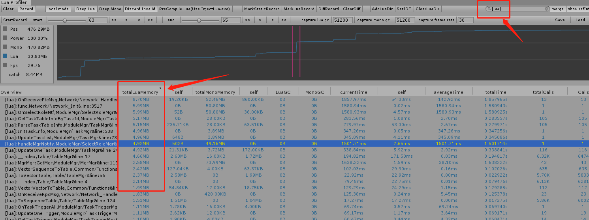
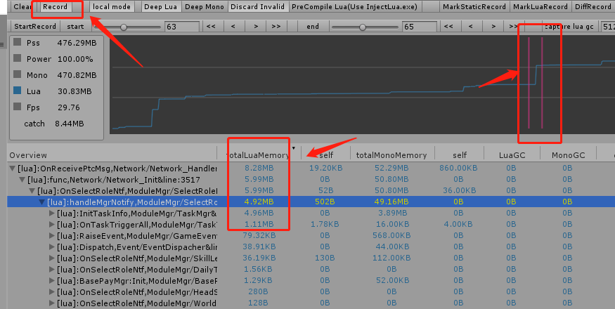

## Lua Profiler For Unity

### 支持情况
目前只支持Windows下，Unity5.6版本以上的编辑器进行使用，支持市场上所有版本的lua，包括各种魔改。


### 部署和安装
直接将example下的LuaProfiler文件夹拷贝到工程目录下。

### 使用说明
在Windows菜单下也有个LuaProfiler选项，点击后即可打开窗口。开启DeepLua,运行游戏就能看到对应的数据。

### 数据说明
| Name                    | Descriptions                                                                                              |
| ----------------------- | -------------------------------------------------------------------------------------------------------   |
| `Overview`              | 函数名称                                                                                                  |
| `totalLuaMemory`        | 此函数生成的所有Lua GC的总和                                                                              |
| `self`                  | 函数本身产生的GC量                                                                                        |
| `totalMonoMemory`       | 此函数生成的所有Mono GC的总和                                                                             |
| `self`                  | 函数本身产生的GC量                                                                                        |
| `currentTime`           | 函数在当前帧中运行所需的时间                                                                              |
| `averageTime`           | 计算在函数上花费的时间的平均值                                                                            |
| `totalTime`             | 此功能消耗的所有时间                                                                                      |
| `LuaGC`                 | 由当前帧生成的Lua GC                                                                                      |
| `MonoGC`                | 由当前帧生成的Mono GC                                                                                     |
| `totalCalls`            | 游戏开始后此功能的运行次数                                                                                |
| `Calls`                 | 函数当前帧的执行次数                                                                                      |

### FAQ

运行起来后totalLuaMemory为负数
>底层统计lua内存申请采用记录lua虚拟机总量来记录对应的GC，如果函数运行的中间发生了GC就会导致内存差值为负数，你可以把自动GC关闭掉后进行统计。

如何对Lua函数进行各种数据排序
>在搜索框中输入：[lua],然后点击右上角的merge按钮,最后点击各个数据标签进行排序


如何定位Lua函数内存暴涨的点
>使用Record模式启动游戏，在想采样的地方点击StartRecord,截取完记录后，找一段明显内存上涨的地方，采样出来分析函数即可.（鼠标点击上去，然后按键盘的左右键）


ref的function代表什么
>这里存储的一般都是C#这里持有的回调函数，你可以每一次打开UI前先clear数据，然后进入UI后记录数据，释放UI后如果 还持有不少委托，就代表说泄漏了。

MarkStaticRecord、MarkLuaRecord、DiffRecord、ClearDiff有什么用
>这一组功能是查泄漏使用的。举一个例子，你可以在打开UI前MarkStaticRecord，进行一次内存快照，然后打开UI后MarkLuaRecord，记录第二次快照，最后你在调用UI释放的函数这里DiffRecord。如果打开UI前不持有，而打开UI后
与释放UI后都持有的对象为泄漏。
函数API为：
```
function miku_do_record(val, prefix, key, record, history, null_list, staticRecord)

function miku_diff(record, staticRecord)
```
DeepMoono、Discard Invalid、Precompile Lua选项有什么用
>DeepMoono：如果你的代码大部分在Assembly-CSharp.dll里面的话，你可以开启DeepMono，这时候将把C#、Lua整个相互调用都显示出来。
Discard Invalid：因为记录的压力实在太大了，所以就把一些没有内存消耗，然后耗时较低的函数排除掉了。
Precompile Lua：有的人实在跑不起来我这套东西，你可以用Tools里面的LuaInject.exe处理一下你的lua代码，使用起来也简单，copy到你的lua文件夹下双击运行一下，对应的代码就插入好了

目前暂时放弃了真机调试，想真机调试的可以去master版本试试看，xlua的项目没有什么大问题

<span id="contact_zh"></span>
### [联系](#zh)
如果您发现任何错误或有任何建议加入QQ群：[882425563](https://jq.qq.com/?_wv=1027&k=5QkOBSc) 与我们联系
##

