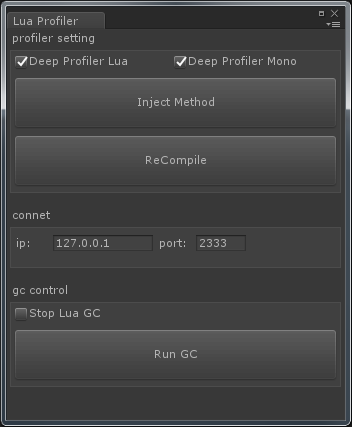

## Lua Profiler For Unity
<br/>

### Purpose
**Unity + Lua** script is now most popular incremental update frameWork for mobile game in China,However, since there haven't been good tool to monitor the cpu and memory usage of lua vm, lots of developers have no idea to optimize their code,so there are many potential risks in lua codes.<br>
this tool is designed to support an **easy-to-use profiler** for unity that help finding bottleneck and make your game more fast and stable.

### Test Demo 
use administrator mode to run the **link.bat** <br/>

### Use renderings


##

### Contact
If you find any bug or have any suggests join the QQ group：[882425563](https://jq.qq.com/?_wv=1027&k=5QkOBSc) to contact us

### Deploy and Install
Lua Profiler For Unity supports **XLua**、**SLua**、**ToLua** and also a remote profiler tool so it supports **Windows**、**Android**、**IOS** On-device Profiler.

- You must open two Unity projects,one for game client ,one for editor server
- Open **LuaProfiler** folder
- Copy **LuaProfilerClient** folder to you game project content,if your C# Lua script is in **Plugins** folder,Copy **LuaProfilerClient** to **Plugins**.This Tool must make sure That code must in the same DLL which has C# lua codes.If you already import Mono.ceil library,delete `LuaProfilerClient/Editor/Ceil`
- Use **Unity5.6 or Newer** Unity version to create a project, copy **LuaProfilerServer** to the project content
- If your Unity version is below 5,call the following code before start the game.
```
MikuLuaProfiler.HookLuaSetup.OnStartGame();
```

### Datas Descriptions

| Name                    | Descriptions                                                                                              |
| ----------------------- | -------------------------------------------------------------------------------------------------------   |
| `Overview`              | function name                                                                                             |
| `totalLuaMemory`        | The sum of all Lua GCs produced by this function If GC happens then the value will not be very accurate   |
| `self`                  | The amount of GC produced by the function itself,**If the value is negative, the subfunction produces a GC**  |
| `totalMonoMemory`       | The sum of all Mono GCs produced by this function If GC happens then the value will not be very accurate  |
| `self`                  | The amount of GC produced by the function itself ,**If the value is negative, the subfunction produces a GC** |
| `currentTime`           | The time it takes for the function to run in current frame                                                |
| `averageTime`           | Count the average value of the time spent on the function                                                 |
| `totalTime`             | All the time consumed by this function                                                                    |
| `LuaGC`                 | Lua GC generated by the current frame                                                                     |
| `MonoGC`                | Mono GC generated by the current frame                                                                    |
| `totalCalls`            | The number of runs of this function after the game starts                                                 |
| `Calls`                 | The number of executions of the current frame of the function                                             |

### Theory
It use mono.ceil's IL inject feature(also use in XLua),inject the profiler code to game code

## 

### Tutors

#### Config your client

Open windows by **"Window->Lua Profiler Window"**, toggle profiler's feature and configure the server ip address.
## 
<br/>

Select the kind of code you want profiler,C# code color is green,and lua code color is blue.<br/>

#### Open server
Also open windows by **"Window->Lua Profiler Window"**, then click **OpenService**,wait for client connects
## 


## 

## 

#### Monitor registry
Programmers tend to forget to release Lua objects that are cached by C#.For example, when XLua calls LuaEnv.Dispose, it throws the exception "try to dispose a LuaEnv with C# callback!"<br/>

The reason is often caused by the following code
```
LuaTable tb = ...
Action action = tb.rawget<Action>("action");
a();
tb.Dispose(); //This line of code tends to forget to call
a= null;      //This line of code tends to forget to call
```
in lua
```
// The lua table tends to forget to call dispose
CS.UIBehaviour.luauiTable = {}
// The callback tends to Unregister
CS.UIButton.OnClick = function() print("test") end
```
They can be released by C#'s destructor, but because in C# is just an index, the memory footprint is small then C# will not be GC immediately, but the memory usage on Lua is very large.
This tool will provide real-time detection of the registry to help locate memory leaks quickly.<br/>

<br/>

And the `add`、`remove` history
<br/>

You can set index '__name' to the lua table,monitor will replace the table code by the value of this index
```
CS.UIBehaviour.loginUI = { __name = "LoginUI" }
```

#### Charts
- Toggle `LuaChart` to open lua memory chart,line color is blue.
- Toggle `MonoChart` to open mono memory chart,line color is green.
- Toggle `FpsChart` to open fps chart,line color is orange.
- Toggle `PssChart` to open fps chart,line color is red.
- Toggle `PowerChart` to open fps chart,line color is brown.

#### Record mode
Click **Record** button, when game connect to server, toggle **StartRecord** to start or stop record.

##### Record button feature

##
<br/>

- drag slider to modify samples
- click __'<'__ 、 __'>'__ to increase or discrease frames one by one
- click __'<<'__ 、 __'>>'__ to fast locate the frames control by 
**Capture Lua GC**、**Capture Mono GC**、**Frame Count**
- stop record and press left or right arrow keybord to increase or discrease frames one by one

##


### On-device Profiler
Set macro **USE_LUA_PROFILER** to inject profiler code in you App.If you want to use **luac code or luajit bytecode** ,use **InjectLua.exe** in folder tools To inject the lua profiler code.

```
InjectLua.exe "inpath" "outpath"
```

### Use Case


## 
### Thanks
[easy66](https://github.com/easy66) <br/>
[Xavier](https://github.com/starwing) <br/>
[Jay](https://github.com/Jayatubi) <br/>
[ZhangDi](https://github.com/ZhangDi2018) <br/>
and all members in qq group [LuaProfiler](https://jq.qq.com/?_wv=1027&k=5QkOBSc)

## 

